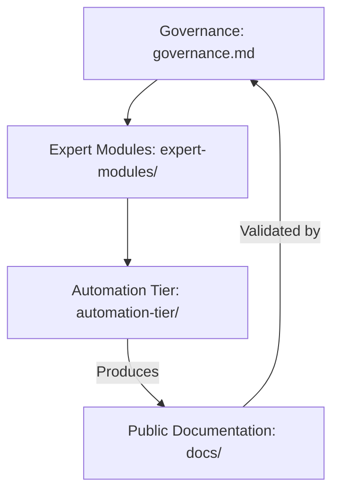

# System Architecture

This page documents how this documentation system is structured, how it maintains synchronization between the Postman collection (the source of truth) and the published MkDocs site, and what each component is responsible for.

---

## Architectural Overview

The system is organized into three deterministic layers, each with a defined and non-overlapping responsibility:

```text
Governance (governance.md)
  └── Systemic policy authority — governs all system behavior
  
Expert Modules (expert-modules/)
  └── Declarative logic — define what to generate and how
  
Automation Tier (automation-tier/)
  └── Mechanical execution — Python scripts that produce output
```

No layer may perform the responsibilities of another. The automation tier never makes semantic decisions. The expert modules never execute file system operations. Governance never routes requests based on heuristics.

---

## Dimensional Hierarchy

The following Mermaid diagram illustrates the deterministic relationship between the three layers of the core architecture:



---

## Source of Truth Hierarchy

Documentation content is derived from sources in strict priority order:

| Priority | Source | Used For |
| --- | --- | --- |
| 1 | Local repository files | Repository structure, configuration |
| 2 | `GitHub Web API Reference.postman_collection.json` | Endpoint definitions, parameters, response schemas |
| 3 | Live API calls | Only when local assets are insufficient |

The Postman collection is the **primary source of truth for all API endpoint documentation**. No endpoint is documented unless it appears in the collection. No parameter is listed unless it is present in the collection's request definition.

---

## Documentation Generation Pipeline

The pipeline follows a fixed execution order:

```text
1. automation-tier/generate_api_ref.py
   Input:  GitHub Web API Reference.postman_collection.json
   Logic:  Reads each top-level Postman folder → flattens sub-items
           → extracts method, URL, parameters, body, responses
   Output: docs/api-reference/{folder-name}.md
   Template: expert-modules/lib/templates/api_endpoint.md.j2

2. automation-tier/generate_workflows.py (when invoked)
   Input:  docs/ content + expert-modules/
   Output: docs/tutorials/, docs/how-to/, docs/explanations/

3. automation-tier/extract_schemas.py (when invoked)
   Input:  Postman collection
   Output: Extracted JSON schemas for validation

4. automation-tier/audit_docs.py (when invoked)
   Input:  docs/ directory + Postman collection
   Output: Synchronization gap report

5. automation-tier/deploy_to_gh_pages.py (when invoked)
   Input:  docs/ + mkdocs.yml
   Output: Published GitHub Pages site
```

---

## Postman Collection Parsing

The Postman collection uses a nested `item` array structure. The automation processors flatten this recursively:

```python
def flatten_items(postman_items):
    requests = []
    for item in postman_items:
        if 'request' in item:
            requests.append(item)
        elif 'item' in item:
            requests.extend(flatten_items(item['item']))
    return requests
```

Each flattened item produces one endpoint section in the generated Markdown, rendered through `api_endpoint.md.j2`.

---

## Template System

All Markdown generation goes through Jinja2 templates stored in `expert-modules/lib/templates/`:

| Template | Purpose |
| --- | --- |
| `api_endpoint.md.j2` | API reference pages (one per Postman folder) |
| `tutorial.md.j2` | Learning-oriented tutorial pages |
| `how_to.md.j2` | Problem-oriented how-to guide pages |
| `explanation.md.j2` | Understanding-oriented explanation pages |

The templates enforce structural consistency. No free-form page generation is permitted when a corresponding template exists.

---

## Navigation Integrity

The `mkdocs.yml` file is the authoritative navigation index. Every page published to the site must appear in the `nav:` section. Pages not listed in `nav:` are orphaned and must not be published.

The navigation structure mirrors the Diátaxis framework:

```yaml
nav:
  - Welcome (index.md)
  - Quick Start
  - Tutorials (learning-oriented)
  - How-to Guides (problem-oriented)
  - Explanations (understanding-oriented)
  - API Reference (information-oriented)
```

---

## Validation and Build Gate

Before publication, the following checks must pass:

| Check | Failure Action |
| --- | --- |
| All `nav:` entries resolve to existing files | Build fails |
| All internal `[text](link)` targets exist | Build fails |
| No Markdown file exists outside `nav:` | Build fails |
| Postman collection parses without error | Generation halts |
| Jinja2 templates render without exception | Generation halts |

Partial builds are never published. The `automation-tier/deploy_to_gh_pages.py` script enforces this gate before invoking `mkdocs gh-deploy`.

---

## Commit-Time Review Protocol

When any of the following change in the repository, the corresponding documentation must be revalidated:

| Change | Affected Documentation |
| --- | --- |
| Postman collection updated | All `docs/api-reference/` pages must be regenerated |
| New Postman folder added | New page generated; `mkdocs.yml` `nav:` updated |
| Endpoint removed from collection | Corresponding page section removed or flagged |
| Authentication flow changes | `docs/explanations/authentication.md` reviewed |
| Rate limit policy changes | `docs/explanations/rate-limiting.md` reviewed |

---

## References

- Governance definition: `governance.md` (repository root)
- Expert Module manifests: `expert-modules/` (repository root)
- Automation Tier scripts: `automation-tier/` (repository root)
- [API Reference](../api-reference/repos.md)
